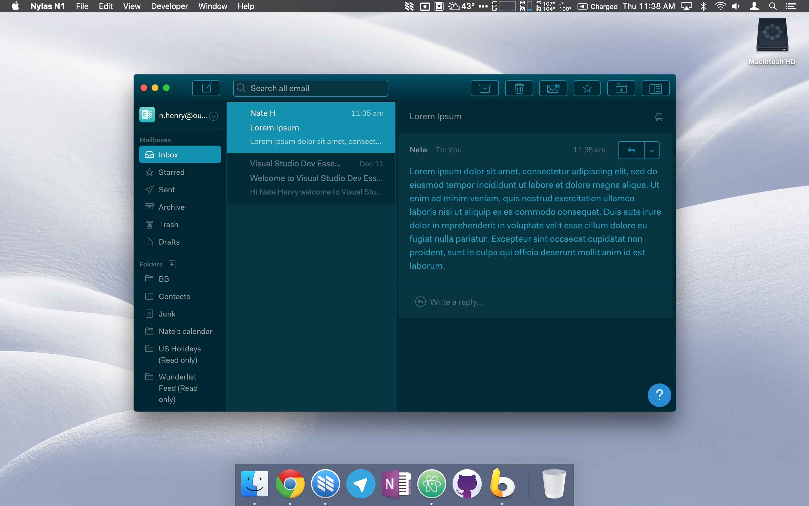

# Taiga

Taiga is a clean, simple, Mailbox-inspired theme for N1 that allows you to focus on what matters most: your emails.



## Installing

1. [Download](https://github.com/noahbuscher/N1-Taiga/releases) the latest release of Taiga
2. Copy it to `~/.nylas/packages`
3. Open `~/.nylas/config.cson`, and add/edit `core.themes` to include your theme; it should look like this:
```
"*":
  env: "staging"
  nylas:
    accounts: [
       ...
    ]
  core:
    themes: [
      "ui-light"
      "N1-Taiga"
    ]
```

Profit! :money_with_wings:
